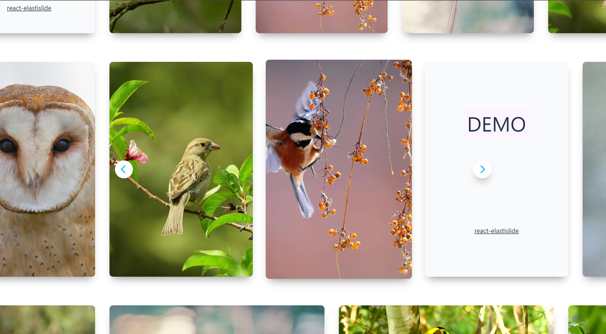

# react-elastislide


**react-elastislide** is a customizable React slider component that supports images, videos, or HTML content with smooth elastic scrolling animations and flexible slide types.

## Installation

```bash
npm i react-elastislide
```

## Usage

### Configuration Options

- `slides: IElastiSlide[]` – An array of slides to display.
- `slideWidth?: number` – The width of each slide (optional).
- `slideHeight?: number` – The height of each slide (optional).
- `gap?: number` – The gap between each slide (optional).
- `animDuration?: number` – Duration of the slide animation in seconds (optional).
- `animDelay?: number` – Delay between slide animations in seconds (optional).
- `btnPrev?: any` – Custom previous button component (optional).
- `btnNext?: any` – Custom next button component (optional).
- `btnPrevContent?: string` – Text content for the previous button (optional).
- `btnNextContent?: string` – Text content for the next button (optional).
- `overflow?: boolean` – Whether to allow the slider to overflow (optional).
- `classNames?: ElastiSliderClassNames` – Custom class names for styling the slider (optional).
- `onSlideClicked?: (index: number, slide: IElastiSlide, slides: IElastiSlide[]) => void` – Callback triggered when a slide is clicked (optional).
- `onFirstScreen?: (slides: IElastiSlide[]) => void` – Callback triggered when the first screen is visible (optional).
- `onLastScreen?: (slides: IElastiSlide[]) => void` – Callback triggered when the last screen is visible (optional).

### Example

```tsx
const esliderConfig: ElastiSliderProps = {
    slides: [
        { src: 'img_1.png', type: ElastiSlideType.Image },
        { src: 'img_2.png', type: ElastiSlideType.Image },
        { src: 'img_3.png', type: ElastiSlideType.Image }
    ],
    slideWidth: 300,
    slideHeight: 300,
    gap: 40,
    animDuration: 0.35,
    animDelay: 0.075,
    overflow: true,
    classNames: {
        container: 'eslider-container',
        arrows: 'eslider-arrows',
        arrow: 'eslider-arrow',
        arrowPrev: 'prev',
        arrowNext: 'next',
        hidden: 'hidden',
        slider: 'eslider',
        slide: 'eslide',
        slideContent: 'eslide-content',
    },
    onSlideClicked: (index: number, slide: IElastiSlide, slides: IElastiSlide[]) => {
        console.log(`Slide clicked: ${index}`, slide);
    }
};

<ElastiSlider {...esliderConfig} />
```

## Demo
**[Demo URL](#)**

---